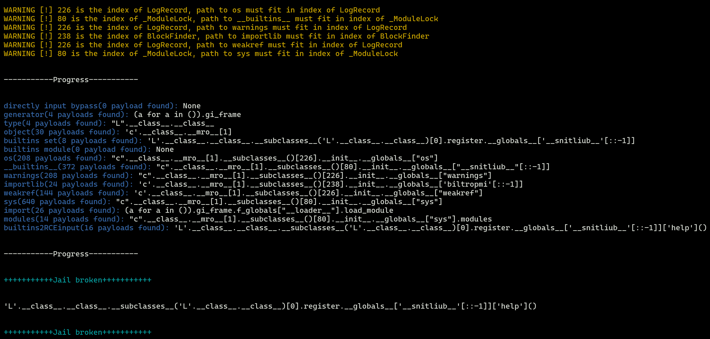

# Typhon: Lets solve pyjail without brain

**本工具目前处于PoC阶段，尚不具备实战能力，也没有在任何平台发布版本（pip，github，etc.）。然而由于基本功能已经实现，我们欢迎各位尝试使用并提供反馈。目前，你可以尝试使用`bypassMAIN`函数来体验本工具的功能。当前阶段，你可以通过阅读[Proof of Concept](#proof-of-concept)部分来了解本工具的核心思路。**

听着，我已经受够那些愚蠢的CTF pyjail题目了——每次我都要浪费时间在又臭又长的黑名单和各种pyjail总结之间找哪个链子没被过滤，或者在命名空间里一个一个运行`dir()`去找能用的东西。这简直就是一种折磨。

所以这就是Typhon，一个致力于让你不需要脑子也能做pyjail的一把梭工具。

**请务必看完本readme后再使用Typhon工具。**

```
    .-')          _           
   (`_^ (    .----`/          
    ` )  \_/`   __/     __,   
    __{   |`  __/      /_/       Typhon: a pyjail bypassing tool
   / _{    \__/ '--.  //      
   \_> \_\  >__/    \((       
        _/ /` _\_   |))       
```

## Highlights

- 不需要大脑就能完成pyjail题目，爱护您的脑细胞和眼球
- 拥有上千条gadgets和几乎所有主流的bypass方法
- 支持多种函数以达成不同功能，如RCE用`bypassRCE()`, 读文件用`bypassRead()`等等

## How to Use

### Install

Typhon已经在pypi发布。你可以使用pip进行安装：

```
pip install TyphonBreaker
```

### Interface

**in Code**

```python
import Typhon
Typhon.bypassRCE(cmd: str,
    local_scope: Dict[str, Any],
    banned_chr: list = [],
    banned_ast: list[ast.AST] = [],
    banned_re: Union[str, list[str]] = [],
    allow_unicode_bypass = False,
    max_length: int = None,
    depth: int = 20,
    print_all_payload: bool = False,
    log_level: str = 'INFO') 
```

`cmd`: RCE所使用的bash command  
`local_scope`: 沙箱内的全局变量空间  
`banned_chr`: 禁止的字符  
`banned_ast`: 禁止的AST节点  
`banned_re`: 禁止的正则表达式（列表或字符串）  
`max_length`: payload的最大长度  
`allow_unicode_bypass`: 是否允许unicode绕过  
`print_all_payload`: 是否打印所有payload  
`depth`: 最大递归深度（建议使用默认值）  
`log_level`: 输出级别（只有`info`和`debug`有意义，不建议更改）  

**Command Line Interface**

这部分不是本工具的重点，但是PR welcome. 

## Step by Step Tutorial

假设有如下题目：

```python
import re
def safe_run(cmd):
    if len(cmd) > 100:
        return "Command too long"
    if any([i for i in ['import', '__builtins__'] if i in cmd]):
        return "WAF!"
    if re.match(r'.*import.*', cmd):
        return "WAF!"
    exec(cmd, {'__builtins__': {}})

safe_run(input("Enter command: "))
```

**Step1. 分析waf**

首先，我们需要分析一下pyjail waf的功能（这可能是唯一需要大脑的地方）。

可以看出，上述题目的waf如下：

- 限制长度最大值为100
- 在exec的命名空间里没有`__builtins__`
- 禁止使用`builtins`字符
- 设置了正则表达式`'.*import.*'`限制条件

**Step2. 将waf导入Typhon**

首先我们将exec行删除：

```python
import re
def safe_run(cmd):
    if len(cmd) > 100:
        return "Command too long"
    if any([i for i in ['import', '__builtins__'] if i in cmd]):
        return "WAF!"
    if re.match(r'.*import.*', cmd):
        return "WAF!"

safe_run(input("Enter command: "))
```

然后，我们以Typhon对应的bypass函数替代exec行，在对应位置导入WAF, **并在该行上方`import Typhon`**：

```python
import re
def safe_run(cmd):
    import Typhon
    Typhon.bypassRCE(cmd,
    banned_chr=['__builtins__'],
    banned_re='.*import.*',
    local_scope={'__builtins__': None},
    max_length=100)

safe_run(input("Enter command: "))
```

**Step3. 运行**

运行你的题目程序，等待**Jail broken**的信息出现即可。



## Important Note

- 一定要将行`import Typhon`放在`Typhon`内置绕过函数的上一行。否则，`Typhon`将无法通过栈帧获取当前的全局变量空间。

**Do:**
```python
def safe_run(cmd):
    import Typhon
    Typhon.bypassRCE(cmd,
    banned_chr=['builtins', 'os', 'exec', 'import'])

safe_run('cat /f*')
```

**Don't:**
```python
import Typhon

def safe_run(cmd):
    Typhon.bypassRCE(cmd,
    banned_chr=['builtins', 'os', 'exec', 'import'])

safe_run('cat /f*')
```

- 使用与题目相同的python版本

Pyjail中存在一些通过索引寻找对应object的gadgets（如继承链）。继承链的利用随着索引变化很大。因此，请务必确保Typhon的运行环境与题目相同。

**无法保证？**

是的，大多数题目都不会给出对应的python版本。因此，**Typhon会在使用涉及版本的gadgets时做出提示**。  

这种情况下往往需要CTF选手自己去找题目环境中该gadgets需要的索引值。  

- 不要在同一次`import`中使用两次`Typhon`的绕过函数。如有需求，请删除已有的`Typhon`模块，并在需要时再导入。

**Do:**
```python
def safe_run(cmd):
    import Typhon
    Typhon.bypassRCE(cmd,
    banned_chr=['builtins', 'os', 'exec', 'import'])
    del Typhon
    import Typhon
    Typhon.bypassRCE(cmd,
    local_scope={'__builtins__': None})

safe_run('cat /f*')
```

**Don't:**
```python
def safe_run(cmd):
    import Typhon
    Typhon.bypassRCE(cmd,
    banned_chr=['builtins', 'os', 'exec', 'import'])
    Typhon.bypassRCE(cmd,
    local_scope={'__builtins__': None})

safe_run('cat /f*')
```

- 这个payload我用不了能不能换一个

你可以在参数中加上`print_all_payload=True`，Typhon就会打印其生成的所有payload。

## Proof of Concept

这就是Typhon的工作原理：

### bypass by path & technique

我们定义两种bypass方式：

- path: 通过不同的载荷进行绕过（例如`os.system('calc')`和`subprocess.Popen('calc')`）  
- technique: 使用不同技术对相同的有效载荷进行处理从而绕过（例如，`os.system('c'+'a'+'l'+'c')` 和 `os.system('clac'[::-1])`)  

Typhon内置了上百种path。每次我们要绕过获取某个东西时，我们先通过local_scope找到所有可以用的`path`，接下来，通过`bypasser.py`中的绕过方式生成每个`path`对应的不同变体，并尝试绕过黑名单。

### gadgets chain

本思路受到[pyjailbreaker](https://github.com/jailctf/pyjailbreaker)工具的启发。

pyjailbreaker不直接通过gadgets一步到位实现RCE，而是一步一步寻找RCE链条中需要的项。如假设存在下列黑名单：

- 本地命名空间无`__builtins__`
- 禁止使用`builtins`字符

对于这个WAF，Typhon是这样处理的：

- 首先，我们通过`'J'.__class__.__class__`获取`type`
- 随后，我们找到获取type后可能可以获取builtins的RCE链子`TYPE.__subclasses__(TYPE)[0].register.__globals__['__builtins__']`
- 已知题目黑名单过滤了`__builtins__`字符，则我们将此path投入bypasser产生数十种变体。选择其中最短的变体：`TYPE.__subclasses__(TYPE)[0].register.__globals__['__snitliub__'[::-1]]`
- 随后，我们找到获取``__builtins__``后的RCE链子`BUILTINS_SET['breakpoint']()`
- 最后，我们将代表builtins字典的占位符`BUILTINS_SET`替换为上步中获取的`__builtins__`路径，以此类推，将`TYPE`占位符替换为真实的路径，就得到了最终的payload。

```
'J'.__class__.__class__.__subclasses__('J'.__class__.__class__)[0].register.__globals__['__snitliub__'[::-1]]['breakpoint']()
```

### Step by Step

Typhon的workflow顺序如下：

- 每一个终点函数（`bypassRCE`, `bypassREAD`，etc.）都会调用主函数`bypassMAIN`，主函数会尽可能搜集所有的可用gadgets（如上例中的`type`）并将收集到的内容传递给对应的下级函数。
- `bypassMAIN`函数在简单分析完当前的变量空间后，会：
  - 尝试直接RCE（如`help()`, `breakporint()`）
  - 尝试获取生成器
  - 尝试获取type
  - 尝试获取object
  - 如当前空间中的__builtins__未被删除，但被修改，尝试恢复（如`id.__self__`）
  - 如当前空间中的__builtins__被删除，尝试从其他命名空间恢复
  - 承上，尝试继承链绕过
  - 尝试获取import包的能力
  - 尝试直接通过可能恢复的__builtins__ RCE
  - 将结果传递给下级函数
- 下级函数拿到`bypassMAIN`的结果后，会根据该函数所实现的需求，选择对应的gadgets进行处理（如`bypassRCE`专注于RCE，`bypassREAD`专注于文件读取，`bypassENV`专注于读取环境变量）。其过程与上述相似。

## Remaining Work to the first release

- [ ] 完善bypass*的终点函数（`bypassRCE`, `bypassREAD`, etc.）
- [ ] 更多的gadgets
- [ ] 更多绕过方法

## Future Work

- [ ] 支持低于python3.7的版本
- [ ] 支持audit hook绕过

## Maintainer

@ [LamentXU (Weilin Du)](https://github.com/LamentXU123)

## License

这个项目在[Apache 2.0](https://github.com/LamentXU123/Typhon/blob/main/LICENSE)协议下发布。

Copyright (c) 2025 Weilin Du.
