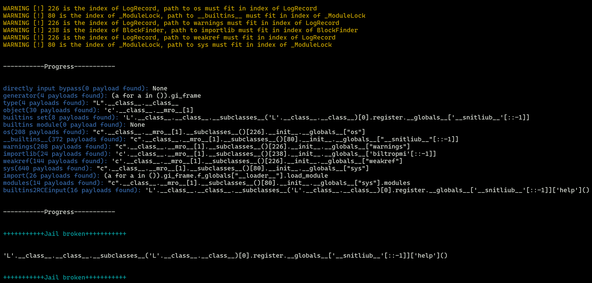

# Typhon: Lets solve pyjail without brain

[简体中文](./README.md) | English

**This tool is currently in the PoC stage and does not have practical capabilities yet, nor has it been released on any platform (pip, github, etc.). However, since the basic functions have been implemented, we welcome everyone to try and provide feedback. Currently, you can try `bypassRCE` Functions to experience the functions of this tool. At present, you can read [Proof of Concept](#proof-of-concept) to partly understand the core ideas of this tool.**

Listen, I'm done with all those stupid dumb dumb CTF pyjail challenges - every time I'm wasting time finding which chain is not filtered between a stinky blacklist and various pyjail summary, or running `dir()` one by one in the namespace Find something that can be used. This is simply torture.

So this is Typhon, a tool dedicated to solve pyjails without having to a brain.


**Please be sure to finish reading this readme before using the Typhon tool.**

```
    .-')          _           
   (`_^ (    .----`/          
    ` )  \_/`   __/     __,   
    __{   |`  __/      /_/       Typhon: a pyjail bypassing tool
   / _{    \__/ '--.  //      
   \_> \_\  >__/    \((       
        _/ /` _\_   |))       
```

## Highlights

- Open source
- You can complete pyjail challenges without a brain, take care of your brain cells and eyeballs
- Have thousands of gadgets and almost all mainstream bypass methods
- Supports multiple functions to achieve different functions, such as RCE `bypassRCE()`, for reading files `bypassRead()` etc.
- Not relying on any third-party libraries.

## How to Use

### Install

When I finish the development of this tool, I will release it on pypi. You can use pip to install:

```
pip install TyphonBreaker
```

### Interface

**in Code**

```python
import Typhon
Typhon.bypassRCE(cmd: str,
    local_scope:dict={},
    banned_chr:list=[],
    banned_ast:list=[],
    banned_re:list=[],
    max_length:int=None,
    allow_unicode_bypass:bool=False,
    print_all_payload:bool=False,
    interactive:bool=True,
    depth:int=5,
    recursion_limit:int=100,
    log_level:str='INFO')
```

`cmd`: bash command used by RCE   
`local_scope`: Global variable space in the sandbox   
`banned_chr`: Forbidden characters   
`banned_ast`: Prohibited AST node   
`banned_re`: Forbidden regular expression (list or string)   
`max_length`: Maximum length of payload   
`allow_unicode_bypass`: Whether to allow unicode to bypass   
`print_all_payload`: Whether to print all payloads   
`interaceive`: if the pyjail is a interactive shell that allows stdin.   
`depth`: is the depth that combined bypassing being generarted.   
`recursion_limit`: is the maximum recursion depth for bypassers.   
`log_level`: Output level (only `info` and `debug` are meaningful, no change is recommended)   

**Command Line Interface**

This part is not the focus of this tool, but PR welcome.

## Step by Step Tutorial

Suppose there is the following question:

```python
import re
def safe_run(cmd):
    if len(cmd) > 160:
        return "Command too long"
    if any([i for i in ['import', '__builtins__', '{}'] if i in cmd]):
        return "WAF!"
    if re.match(r'.*import.*', cmd):
        return "WAF!"
    exec(cmd, {'__builtins__': {}})

safe_run(input("Enter command: "))
```

**Step1. Analysis waf**

First, we need to analyze the functionality of pyjail waf (which is probably the only place where the brain is needed).

It can be seen that the waf of the above question is as follows:

- The maximum limit length is 160
- There is no exec namespace `__builtins__`
- No use `builtins`, `import`, `{}` characters
- Set regular expressions `'.*import.*'` limitation conditions

**Step2. Import waf into Typhon**

First we delete the exec line:

```python
import re
def safe_run(cmd):
    if len(cmd) > 160:
        return "Command too long"
    if any([i for i in ['import', '__builtins__', '{}'] if i in cmd]):
        return "WAF!"
    if re.match(r'.*import.*', cmd):
        return "WAF!"

safe_run(input("Enter command: "))
```

Then, we replace the exec line with the bypass function corresponding to Typhon, import WAF at the corresponding position, **and above the line `import Typhon`**：

```python
import re
def safe_run(cmd):
    import Typhon
    Typhon.bypassRCE(cmd,
    banned_chr=['__builtins__', 'import', '{}'],
    banned_re='.*import.*',
    local_scope={'__builtins__': None},
    max_length=160)

safe_run(input("Enter command: "))
```

**Step3. Run**

Run your question program and wait for the **Jail broken** message to appear.



## Important Note

- Must make `import Typhon` the very previous line of the `bypass*` function (even if you have been obsessed with PEP-8). otherwise, the current global variable space will not be available through the stack frame.

**Do:**
```python
def safe_run(cmd):
    import Typhon
    Typhon.bypassRCE(cmd,
    banned_chr=['builtins', 'os', 'exec', 'import'])

safe_run('cat /f*')
```

**Don't:**
```python
import Typhon

def safe_run(cmd):
    Typhon.bypassRCE(cmd,
    banned_chr=['builtins', 'os', 'exec', 'import'])

safe_run('cat /f*')
```

- Use the same python version as the title

There are some gadgets (such as inheritance chains) that search for corresponding object through indexes. The utilization of inheritance chains varies greatly with the index. Therefore, make sure that the running environment of Typhon is the same as the challenge.

**Not guaranteed?**

Yes, most questions won't give the corresponding python version. Therefore, **Typhon will prompt when using gadgets involving versions.**


In this case, CTF players often need to find the index value required by the gadgets in the question environment.

- I can't use this payload, can I change it?

You can add the parameters `print_all_payload=True` , Typhon will print all the payloads it generates.

- This WEB challenge doesn't seem to have stdin open, my `exec(input())` didn't work.

You can add `interactive=False` to the argument and Typhon will disable all payloads involving `stdin`.


## Proof of Concept

This is how Typhon works:

### bypass by path & technique

We define two ways of bypass:

- path: Bypassed by different loads (e.g.`os.system('calc')`and`subprocess.Popen('calc')`)  
- technique: Use different techniques to process the same payload to bypass (e.g.`os.system('c'+'a'+'l'+'c')`and`os.system('clac'[::-1])`)  

Typhon has hundreds of built-in paths. Every time we want to bypass getting something, we first find all available through local_scope.`path`, Next, with `technique` in `bypasser.py`, each different variants is generated from each `path` and try to bypass the blacklist.

### gadgets chain

This idea is inspired by [pyjailbreaker](https://github.com/jailctf/pyjailbreaker).

pyjailbreaker does not directly implement RCE through gadgets in one step, but instead searches for the items needed in the RCE chain step by step. If the following blacklist exists:

- Local namespace no `__builtins__`
- No use `builtins` character

For this WAF, Typhon handles it like this:

- First, we use `'J'.__class__.__class__`to `type`
- Then we find the RCE chain that may be able to obtain builtins after obtaining the type `TYPE.__subclasses__(TYPE)[0].register.__globals__['__builtins__']`
- The blacklist has been filtered `__builtins__` characters, so we put this path into bypasser to produce dozens of variants. Choose the shortest variant:`TYPE.__subclasses__(TYPE)[0].register.__globals__['__snitliub__'[::-1]]`
- Then we find the chain used when we already got ``__builtins__``: `BUILTINS_SET['breakpoint']()`
- Finally, we replace the placeholder `BUILTINS_SET` and `TYPE` to true pathes.

```python
'J'.__class__.__class__.__subclasses__('J'.__class__.__class__)[0].register.__globals__['__snitliub__'[::-1]]['breakpoint']()
```

### Step by Step

The order of workflow for Typhon is as follows:

- Each endpoint function (`bypassRCE`, `bypassREAD`, etc.) will call the main function `bypassMAIN`, the main function will collect all available gadgets as much as possible (as in the above example `type`) and pass the collected content to the corresponding subordinate function.
- when `bypassMAIN` is called, after the function simply analyzes the current variable space, it will:
  - Try to RCE directly (e.g.`help()`, `breakporint()`)
  - Try to get generator
  - Try to get type
  - Try to get object
  - If the `__builtins__` in the current scope has not been deleted, but has been modified, try to restore (such as`id.__self__`)
  - If the `__builtins__` in the current scope is deleted, try to restore it from other namespaces
  - Try inheritance chain bypasses
  - Try to gain access to import packages
  - Try to directly recover through the `__builtins__` RCE
  - Pass the result to the lower function
- Get the lower function`bypassMAIN`After the result, the corresponding gadgets will be selected for processing according to the requirements implemented by the function (such as`bypassRCE`Focus on RCE,`bypassREAD`Focus on file reading,`bypassENV`Focus on reading environment variables). The process is similar to the above.

## Remaining Work to the first release

- [ ] Improve the end point function of bypass* (`bypassRCE`, `bypassREAD`, etc.)
- [ ] Better bypasser logic
- [ ] More gadgets
- [ ] More bypass methods (`techniques`)

## Future Work

- [ ] Supports versions below python 3.9
- [ ] Support audit hook bypass

## Contributors

**Author & Maintainer**

@ [LamentXU (Weilin Du)](https://github.com/LamentXU123)  

**Credits**

Thanks to all the contributors who have helped improve this project.

<a href="https://github.com/eryajf/learn-github/graphs/contributors">
  
</a>

**Speical Thanks**

@ [hdsec](https://hdsec.cn) for giving me the necessary encouragement
@ [pyjailbreaker](https://github.com/jailctf/pyjailbreaker) for inspiring me

## License

This project is release under [Apache 2.0](https://github.com/LamentXU123/Typhon/blob/main/LICENSE).

Copyright (c) 2025 Weilin Du.

<picture>
<source media="(prefers-color-scheme: dark)" srcset="https://api.star-history.com/svg?repos=Team-intN18-SoybeanSeclab/Typhon&type=Date&theme=dark" />
<source media="(prefers-color-scheme: light)" srcset="https://api.star-history.com/svg?repos=Team-intN18-SoybeanSeclab/Typhon&type=Date" />

</picture>

